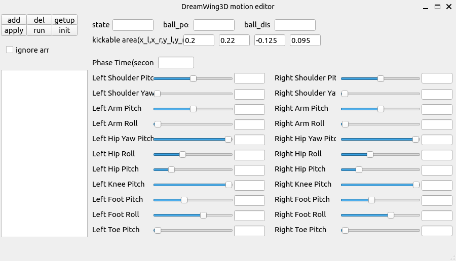

# DreamWing3D-Motion-Editor
> 这是一个基于FCP底层的动作编辑器，由DreamWing设计


## 使用前请先对server进行设置
```bash
python3 Run_Util.py
```
选择**0-Server**，然后按照如下所示设置

```plain
=======================================================================================================
        Setting         |  Value  |                            Description                             
------------------------+---------+--------------------------------------------------------------------
   0-Official Config    |  Off    |  Configuration used in official matches                            
   1-Penalty Shootout   |  Off    |  Server's Penalty Shootout mode                                    
   2-Soccer Rules       |  On     |  Play modes, automatic referee, etc.                               
   3-Sync Mode          |  On     |  Synchronous communication between agents and server               
   4-Real Time          |  On     |  Real Time (or maximum server speed)                               
   5-Cheats             |  On     |  Agent position & orientation, ball position                       
   6-Full Vision        |  Off    |  See 360 deg instead of 120 deg (vertically & horizontally)        
   7-Add Noise          |  On     |  Noise added to the position of visible objects                    
   8-25Hz Monitor       |  On     |  25Hz Monitor (or 50Hz but RoboViz will show 2x the actual speed)  
=======================================================================================================
```
## 使用技巧
1. ctrl+o打开动作文件（此处动作文件可以是DreamWing动作采集器生成的）
2. ctrl+s保存动作文件
3. 单击帧列表的一项，右边面板显示该帧的关节角度信息
4. 双击帧列表的一项，机器人各个关节会慢慢转变到该帧的目标状态
5. 勾选`ignore arm`可以在执行动作时不改变手部关节（适用于快踢场景）
## 温馨提示
1. 左边面板上某些按钮存在bug，但本人即将变成牛马没有时间玩3D了懒得改代码了，所以该编辑器更多的用于观察动作，欢迎有兴趣的同学在原有基础上进行优化
2. `init`按钮定位机器人到`(-14.8,0)`，同时让球移动到`(-14,0)`
3. 点击`run`按钮，机器人会根据右边上部分定位信息输入框的内容先进行踢球定位再执行踢球动作
4. `motioneditor/motion`目录下有已经使用[DreamWing3D动作采集器](https://github.com/TansirFlow/DreamWing-Action-Sampler)完整采集并裁剪过的开箱即用的Apollo Open Motion
## 感谢
1. **FCPortugal团队** 开源的底层，原仓库地址:[https://github.com/m-abr/FCPCodebase](https://github.com/m-abr/FCPCodebase)
2. **南京邮电大学Apollo3D团队** 开源的快踢和大脚动作，仓库地址：[https://github.com/Jiangtianjian/Framework-Skills-Optimization](https://github.com/Jiangtianjian/Framework-Skills-Optimization)

# FC Portugal Codebase <br> for RoboCup 3D Soccer Simulation League


## About

The FC Portugal Codebase was mainly written in Python, with some C++ modules. It was created to simplify and speed up the development of a team for participating in the RoboCup 3D Soccer Simulation League. We hope this release helps existing teams transition to Python more easily, and provides new teams with a robust and modern foundation upon which they can build new features.


## Documentation

The documentation is available [here](https://docs.google.com/document/d/1aJhwK2iJtU-ri_2JOB8iYvxzbPskJ8kbk_4rb3IK3yc/edit)

## Features

- The team is ready to play!
    - Sample Agent - the active agent attempts to score with a kick, while the others maintain a basic formation
        - Launch team with: **start.sh**
    - Sample Agent supports [Fat Proxy](https://github.com/magmaOffenburg/magmaFatProxy) 
        - Launch team with: **start_fat_proxy.sh**
    - Sample Agent Penalty - a striker performs a basic kick and a goalkeeper dives to defend
        - Launch team with: **start_penalty.sh**
- Skills
    - Get Ups (latest version)
    - Walk (latest version)
    - Dribble v1 (version used in RoboCup 2022)
    - Step (skill-set-primitive used by Walk and Dribble)
    - Basic kick
    - Basic goalkeeper dive
- Features
    - Accurate localization based on probabilistic 6D pose estimation [algorithm](https://doi.org/10.1007/s10846-021-01385-3) and IMU
    - Automatic head orientation
    - Automatic communication with teammates to share location of all visible players and ball
    - Basics: common math ops, server communication, RoboViz drawings (with arrows and preset colors)
    - Behavior manager that internally resets skills when necessary
    - Bundle script to generate a binary and the corresponding start/kill scripts
    - C++ modules are automatically built into shared libraries when changes are detected
    - Central arguments specification for all scripts
    - Custom A* pathfinding implementation in C++, optimized for the soccer environment
    - Easy integration of neural-network-based behaviors
    - Integration with Open AI Gym to train models with reinforcement learning
        - User interface to train, retrain, test & export trained models
        - Common features from Stable Baselines were automated, added evaluation graphs in the terminal
        - Interactive FPS control during model testing, along with logging of statistics
    - Interactive demonstrations, tests and utilities showcasing key features of the team/agents
    - Inverse Kinematics
    - Multiple agents can be launched on a single thread, or one agent per thread
    - Predictor for rolling ball position and velocity
    - Relative/absolute position & orientation of every body part & joint through forward kinematics and vision
    - Sample train environments
    - User-friendly interface to check active arguments and launch utilities & gyms

## Citing the Project

```
@article{abreu2023designing,
  title={Designing a Skilled Soccer Team for RoboCup: Exploring Skill-Set-Primitives through Reinforcement Learning},
  author={Abreu, Miguel and Reis, Luis Paulo and Lau, Nuno},
  journal={arXiv preprint arXiv:2312.14360},
  year={2023}
}
```